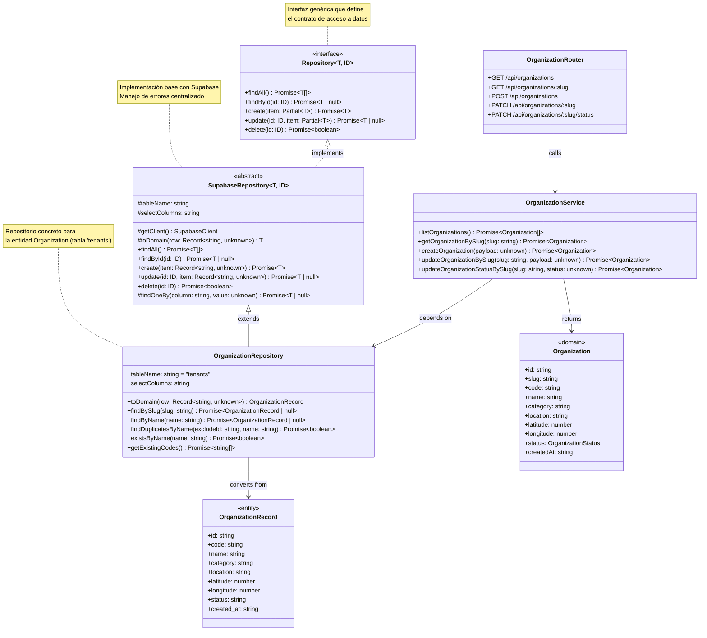

# Implementación del Patrón de Acceso a Datos (Repository)

## Información del Documento

| Campo | Detalle |
|-------|---------|
| Proyecto | SIGO-Ollas - Sistema de Gestión de Ollas Comunes |
| Patrón elegido | Repository Pattern |
| Versión | 1.0 |
| Fecha | Mayo 2026 |

---

## 1. Patrón de Acceso a Datos Elegido: **Repository**

El patrón **Repository** actúa como una capa de abstracción entre la lógica de negocio (servicios) y la fuente de datos (base de datos). Su objetivo principal es centralizar las operaciones de acceso a datos en un solo lugar, permitiendo cambiar la implementación de persistencia sin afectar a los servicios que la consumen.

### 1.1 Justificación Técnica

| Criterio | Beneficio |
|----------|-----------|
| **Separación de responsabilidades** | Los servicios se enfocan en lógica de negocio; los repositorios en persistencia |
| **Testabilidad** | Los repositorios pueden ser mockeados fácilmente en pruebas unitarias |
| **Consistencia** | Todas las operaciones de BD pasan por la misma capa, garantizando manejo uniforme de errores |
| **Mantenibilidad** | Los cambios en la fuente de datos (ej: migrar a otro proveedor) solo afectan a los repositorios |
| **Reutilización** | La lógica de consultas comunes (findAll, findById) se define una vez en la base abstracta |

---

## 2. Diagrama de Clases



---

## 3. Estructura del Código Fuente

### 3.1 Interfaz Genérica del Repositorio

**Archivo**: `backend/src/lib/repository.ts`

```typescript
export interface Repository<T, ID> {
  findAll(): Promise<T[]>
  findById(id: ID): Promise<T | null>
  create(item: Partial<T>): Promise<T>
  update(id: ID, item: Partial<T>): Promise<T | null>
  delete(id: ID): Promise<boolean>
}
```

### 3.2 Implementación Base Abstracta (SupabaseRepository)

**Archivo**: `backend/src/lib/repository.ts`

La clase `SupabaseRepository` implementa la interfaz `Repository` y proporciona:

- **Manejo centralizado de errores**: Todas las operaciones lanzan `SupabaseError` con código HTTP consistente
- **Cliente Supabase**: Inicialización y validación de configuración centralizada
- **Métodos protected**: `findOneBy` para consultas por columna específica
- **Métodos abstractos**: `tableName`, `selectColumns`, `toDomain` que cada repositorio concreto debe implementar

### 3.3 Repositorio Concreto (OrganizationRepository)

**Archivo**: `backend/src/modules/organizations/repository.ts`

```typescript
export class OrganizationRepository extends SupabaseRepository<OrganizationRecord, string> {
  protected tableName = 'tenants'
  protected selectColumns = 'id, code, name, category, location, latitude, longitude, status, created_at'

  protected toDomain(row: Record<string, unknown>): OrganizationRecord {
    return { /* mapeo de columnas a entidad */ }
  }

  // Métodos específicos de negocio
  async findBySlug(slug: string): Promise<OrganizationRecord | null> { ... }
  async existsByName(name: string): Promise<boolean> { ... }
  async getExistingCodes(): Promise<string[]> { ... }
}
```

### 3.4 Servicio Refactorizado

**Archivo**: `backend/src/modules/organizations/service.ts`

El servicio ahora depende del repositorio en lugar de llamar a Supabase directamente:

```typescript
export async function listOrganizations(): Promise<Organization[]> {
  const records = await organizationRepository.findAll()
  return records.map(toOrganization)
}

export async function createOrganization(payload: unknown): Promise<Organization> {
  const data = parseOrganizationPayload(payload)
  const exists = await organizationRepository.existsByName(data.name)
  if (exists) throw new OrganizationServiceError(409, '...')
  const code = buildUniqueOrganizationCode(data.name, await organizationRepository.getExistingCodes())
  const record = await organizationRepository.create({ code, ...data, status: 'active' })
  return toOrganization(record)
}
```

---

## 4. Flujo de una Petición

```
Petición HTTP
    │
    ▼
OrganizationRouter (router.ts)
    │  Define rutas, maneja errores HTTP
    ▼
OrganizationService (service.ts)
    │  Lógica de negocio, validaciones, transformaciones
    ▼
OrganizationRepository (repository.ts)
    │  Operaciones CRUD contra Supabase
    ▼
SupabaseRepository (lib/repository.ts)
    │  Cliente Supabase genérico, manejo de errores
    ▼
Supabase / PostgreSQL
```

---

## 5. Cobertura del Proyecto

Actualmente, el patrón Repository está implementado para el módulo **Organization** (`tenants`). Para extenderlo a otros módulos, solo se necesita:

1. Crear un nuevo archivo `repository.ts` en el módulo correspondiente
2. Extender `SupabaseRepository` con el tipo de entidad adecuado
3. Implementar `toDomain()` y métodos de negocio específicos

---

## 6. Referencias

- Fowler, M. (2002). *Patterns of Enterprise Application Architecture*. Addison-Wesley. (Repository pattern, p. 322)
- Microsoft Docs - Repository Pattern: https://learn.microsoft.com/en-us/dotnet/architecture/microservices/microservice-ddd-cqrs-patterns/infrastructure-persistence-layer-design
- Código fuente completo: `backend/src/lib/repository.ts`
- Ejemplo concreto: `backend/src/modules/organizations/repository.ts`
- Servicio refactorizado: `backend/src/modules/organizations/service.ts`
