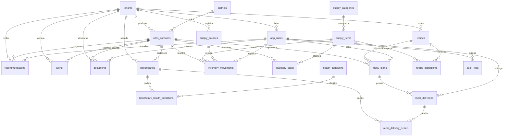

# Diseño Físico de Base de Datos - SIGO-Ollas

## Información del Documento

| Campo | Detalle |
|-------|---------|
| Proyecto | SIGO-Ollas - Sistema de Gestión de Ollas Comunes |
| Motor de BD | PostgreSQL 15 (via Supabase) |
| Versión del Esquema | V3 |
| Fecha | Mayo 2026 |

---

## 1. Diagrama Físico de Base de Datos



---

## 2. Diccionario de Tablas

### 2.1 Núcleo SaaS y Usuarios

#### `tenants` - Organizaciones (Multi-tenant)

| Columna | Tipo | Restricciones | Descripción |
|---------|------|---------------|-------------|
| id | uuid | PK, DEFAULT gen_random_uuid() | Identificador único |
| code | varchar(50) | UNIQUE, NOT NULL | Código corto de organización |
| name | varchar(150) | NOT NULL | Nombre de la organización |
| category | varchar(100) | | Categoría (municipalidad, ONG, etc.) |
| location | varchar(100) | | Ubicación principal |
| latitude | numeric | | Latitud para geolocalización |
| longitude | numeric | | Longitud para geolocalización |
| status | varchar(20) | NOT NULL, CHECK(active,inactive) | Estado del tenant |
| created_at | timestamptz | NOT NULL, DEFAULT now() | Fecha de creación |

**Índices**: PK por `id`, UNIQUE por `code`

#### `app_users` - Usuarios del Sistema

| Columna | Tipo | Restricciones | Descripción |
|---------|------|---------------|-------------|
| id | uuid | PK, DEFAULT gen_random_uuid() | Identificador único |
| tenant_id | uuid | FK → tenants(id), NOT NULL | Organización a la que pertenece |
| email | text | UNIQUE, NOT NULL | Email de inicio de sesión |
| full_name | varchar(150) | NOT NULL | Nombre completo |
| password_hash | text | NOT NULL | Hash bcrypt de la contraseña |
| role | varchar(30) | NOT NULL, CHECK(admin_municipal,lideresa_olla,supervisor) | Rol del usuario |
| status | varchar(20) | NOT NULL, CHECK(active,inactive) | Estado de la cuenta |
| created_at | timestamptz | NOT NULL, DEFAULT now() | Fecha de registro |

**Índices**: PK por `id`, UNIQUE por `email`, IDX por `tenant_id`

### 2.2 Estructura Territorial y Operativa

#### `districts` - Distritos

| Columna | Tipo | Restricciones | Descripción |
|---------|------|---------------|-------------|
| id | smallserial | PK | Identificador único |
| name | varchar(100) | UNIQUE, NOT NULL | Nombre del distrito |

#### `ollas_comunes` - Ollas Comunes (Sopas comunitarias)

| Columna | Tipo | Restricciones | Descripción |
|---------|------|---------------|-------------|
| id | uuid | PK, DEFAULT gen_random_uuid() | Identificador único |
| tenant_id | uuid | FK → tenants(id), NOT NULL | Organización responsable |
| district_id | smallint | FK → districts(id) | Distrito donde opera |
| code | varchar(50) | NOT NULL | Código interno |
| name | varchar(150) | NOT NULL | Nombre de la olla común |
| address | text | | Dirección física |
| contact_name | varchar(150) | | Nombre de contacto |
| contact_phone | varchar(30) | | Teléfono de contacto |
| estimated_daily_capacity | integer | CHECK(≥ 0) | Capacidad estimada diaria |
| status | varchar(20) | NOT NULL, CHECK(active,inactive) | Estado operativo |
| created_at | timestamptz | NOT NULL, DEFAULT now() | Fecha de creación |

**Índices**: PK por `id`, UNIQUE(tenant_id, code), IDX por `tenant_id`, `district_id`

### 2.3 Padrón y Perfil de Salud

#### `beneficiaries` - Beneficiarios

| Columna | Tipo | Restricciones | Descripción |
|---------|------|---------------|-------------|
| id | uuid | PK, DEFAULT gen_random_uuid() | Identificador único |
| tenant_id | uuid | FK → tenants(id), NOT NULL | Organización |
| olla_id | uuid | FK → ollas_comunes(id) | Olla común asignada |
| dni | varchar(20) | UNIQUE | Documento Nacional de Identidad |
| first_name | varchar(100) | NOT NULL | Nombres |
| last_name | varchar(100) | NOT NULL | Apellidos |
| gender | varchar(20) | NOT NULL, CHECK(male,female,other,not_specified) | Género |
| birth_date | date | NOT NULL | Fecha de nacimiento |
| phone | varchar(30) | | Teléfono de contacto |
| address | text | | Dirección de domicilio |
| priority_level | varchar(20) | DEFAULT 'normal', CHECK(low,normal,high) | Nivel de prioridad |
| status | varchar(20) | NOT NULL, CHECK(active,inactive) | Estado del registro |
| registered_at | timestamptz | NOT NULL, DEFAULT now() | Fecha de registro |

**Índices**: PK por `id`, UNIQUE por `dni`, IDX por `tenant_id`, `olla_id`, `status`

#### `health_conditions` - Condiciones de Salud

| Columna | Tipo | Restricciones | Descripción |
|---------|------|---------------|-------------|
| id | smallserial | PK | Identificador único |
| name | varchar(100) | UNIQUE, NOT NULL | Nombre (Anemia, Diabetes, etc.) |
| status | varchar(20) | NOT NULL, CHECK(active,inactive) | Estado |

#### `beneficiary_health_conditions` - Relación Beneficiario-Salud

| Columna | Tipo | Restricciones | Descripción |
|---------|------|---------------|-------------|
| beneficiary_id | uuid | FK → beneficiaries(id), NOT NULL | Beneficiario |
| health_condition_id | smallint | FK → health_conditions(id), NOT NULL | Condición de salud |
| notes | text | | Notas adicionales |

**Índices**: PK compuesta(beneficiary_id, health_condition_id)

### 2.4 Inventario y Abastecimiento

#### `supply_categories` - Categorías de Insumos

| Columna | Tipo | Restricciones | Descripción |
|---------|------|---------------|-------------|
| id | smallserial | PK | Identificador único |
| name | varchar(100) | UNIQUE, NOT NULL | Nombre (Granos, Verduras, etc.) |

#### `supply_sources` - Fuentes de Abastecimiento

| Columna | Tipo | Restricciones | Descripción |
|---------|------|---------------|-------------|
| id | uuid | PK, DEFAULT gen_random_uuid() | Identificador único |
| tenant_id | uuid | FK → tenants(id), NOT NULL | Organización |
| source_type | varchar(30) | NOT NULL, CHECK(municipality,ngo,company,private_donor,local_purchase) | Tipo de fuente |
| name | varchar(150) | NOT NULL | Nombre del proveedor |
| contact_name | varchar(150) | | Persona de contacto |
| contact_phone | varchar(30) | | Teléfono de contacto |
| notes | text | | Notas |
| status | varchar(20) | NOT NULL, CHECK(active,inactive) | Estado |
| created_at | timestamptz | NOT NULL, DEFAULT now() | Fecha de registro |

**Índices**: PK por `id`, IDX por `tenant_id`, `source_type`

#### `supply_items` - Insumos

| Columna | Tipo | Restricciones | Descripción |
|---------|------|---------------|-------------|
| id | uuid | PK, DEFAULT gen_random_uuid() | Identificador único |
| category_id | smallint | FK → supply_categories(id) | Categoría del insumo |
| name | varchar(120) | NOT NULL | Nombre del insumo |
| unit | varchar(20) | NOT NULL, CHECK(kg,g,lt,ml,un) | Unidad de medida |
| is_perishable | boolean | NOT NULL, DEFAULT true | ¿Es perecedero? |
| status | varchar(20) | NOT NULL, CHECK(active,inactive) | Estado |

**Índices**: PK por `id`, UNIQUE(name, unit)

#### `inventory_movements` - Movimientos de Inventario

| Columna | Tipo | Restricciones | Descripción |
|---------|------|---------------|-------------|
| id | uuid | PK, DEFAULT gen_random_uuid() | Identificador único |
| tenant_id | uuid | FK → tenants(id), NOT NULL | Organización |
| olla_id | uuid | FK → ollas_comunes(id), NOT NULL | Olla común |
| supply_item_id | uuid | FK → supply_items(id), NOT NULL | Insumo |
| source_id | uuid | FK → supply_sources(id) | Fuente de abastecimiento |
| movement_type | varchar(20) | NOT NULL, CHECK(in,out,adjustment,waste) | Tipo de movimiento |
| quantity | numeric(12,2) | NOT NULL, CHECK(> 0) | Cantidad |
| movement_date | timestamptz | NOT NULL, DEFAULT now() | Fecha del movimiento |
| notes | text | | Notas |
| created_by | uuid | FK → app_users(id) | Usuario que registró |

**Índices**: PK por `id`, IDX por `tenant_id`, `olla_id`, `supply_item_id`, `source_id`, `movement_date`

#### `inventory_stock` - Stock Actual

| Columna | Tipo | Restricciones | Descripción |
|---------|------|---------------|-------------|
| olla_id | uuid | FK → ollas_comunes(id), NOT NULL | Olla común |
| supply_item_id | uuid | FK → supply_items(id), NOT NULL | Insumo |
| quantity | numeric(12,2) | NOT NULL, CHECK(≥ 0), DEFAULT 0 | Cantidad actual |
| updated_at | timestamptz | NOT NULL, DEFAULT now() | Última actualización |

**Índices**: PK compuesta(olla_id, supply_item_id)

### 2.5 Recetas, Menús y Entregas

#### `recipes` - Recetas

| Columna | Tipo | Restricciones | Descripción |
|---------|------|---------------|-------------|
| id | uuid | PK, DEFAULT gen_random_uuid() | Identificador único |
| tenant_id | uuid | FK → tenants(id), NOT NULL | Organización |
| name | varchar(150) | NOT NULL | Nombre de la receta |
| description | text | | Descripción / instrucciones |
| estimated_servings | integer | NOT NULL, DEFAULT 1, CHECK(> 0) | Porciones estimadas |
| status | varchar(20) | NOT NULL, CHECK(active,inactive) | Estado |
| created_at | timestamptz | NOT NULL, DEFAULT now() | Fecha de creación |

**Índices**: PK por `id`, UNIQUE(tenant_id, name), IDX por `tenant_id`

#### `recipe_ingredients` - Ingredientes de Recetas

| Columna | Tipo | Restricciones | Descripción |
|---------|------|---------------|-------------|
| recipe_id | uuid | FK → recipes(id), NOT NULL | Receta |
| supply_item_id | uuid | FK → supply_items(id), NOT NULL | Insumo |
| quantity | numeric(12,2) | NOT NULL, CHECK(> 0) | Cantidad necesaria |
| unit | varchar(20) | NOT NULL, CHECK(kg,g,lt,ml,un) | Unidad de medida |
| notes | text | | Notas (ej. "opcional") |

**Índices**: PK compuesta(recipe_id, supply_item_id)

#### `menu_plans` - Planificación de Menús

| Columna | Tipo | Restricciones | Descripción |
|---------|------|---------------|-------------|
| id | uuid | PK, DEFAULT gen_random_uuid() | Identificador único |
| olla_id | uuid | FK → ollas_comunes(id), NOT NULL | Olla común |
| recipe_id | uuid | FK → recipes(id) | Receta asociada |
| operation_date | date | NOT NULL | Fecha de operación |
| dish_name | varchar(150) | NOT NULL | Nombre del plato |
| planned_servings | integer | NOT NULL, CHECK(> 0) | Raciones planificadas |
| suggested_by_type | varchar(20) | NOT NULL, CHECK(user,ia) | ¿Sugerido por IA o usuario? |
| created_by | uuid | FK → app_users(id) | Usuario que creó |
| status | varchar(20) | NOT NULL, CHECK(draft,approved,executed,cancelled) | Estado del menú |
| created_at | timestamptz | NOT NULL, DEFAULT now() | Fecha de creación |

**Índices**: PK por `id`, UNIQUE(olla_id, operation_date), IDX por `olla_id`, `operation_date`, `recipe_id`

#### `meal_deliveries` - Entregas de Comida

| Columna | Tipo | Restricciones | Descripción |
|---------|------|---------------|-------------|
| id | uuid | PK, DEFAULT gen_random_uuid() | Identificador único |
| menu_plan_id | uuid | FK → menu_plans(id), NOT NULL | Plan de menú ejecutado |
| delivered_at | timestamptz | NOT NULL, DEFAULT now() | Fecha/hora de entrega |
| total_rations | integer | NOT NULL, CHECK(≥ 0) | Total de raciones entregadas |
| created_by | uuid | FK → app_users(id) | Usuario que registró |

**Índices**: PK por `id`, IDX por `menu_plan_id`

#### `meal_delivery_details` - Detalle de Entregas

| Columna | Tipo | Restricciones | Descripción |
|---------|------|---------------|-------------|
| delivery_id | uuid | FK → meal_deliveries(id), NOT NULL | Entrega |
| beneficiary_id | uuid | FK → beneficiaries(id), NOT NULL | Beneficiario |
| ration_type | varchar(50) | | Tipo de ración (completa, media, etc.) |

**Índices**: PK compuesta(delivery_id, beneficiary_id)

### 2.6 Recomendaciones, Alertas y Auditoría

#### `recommendations` - Recomendaciones (IA y Sistema)

| Columna | Tipo | Restricciones | Descripción |
|---------|------|---------------|-------------|
| id | uuid | PK, DEFAULT gen_random_uuid() | Identificador único |
| tenant_id | uuid | FK → tenants(id), NOT NULL | Organización |
| olla_id | uuid | FK → ollas_comunes(id) | Olla común asociada |
| recommendation_type | varchar(30) | NOT NULL, CHECK(menu,priority,stock_alert) | Tipo de recomendación |
| target_date | date | | Fecha objetivo |
| related_recipe_id | uuid | FK → recipes(id) | Receta sugerida |
| title | varchar(150) | NOT NULL | Título de la recomendación |
| description | text | | Descripción detallada |
| generated_by_type | varchar(20) | NOT NULL, CHECK(ia,system,user) | Generado por |
| status | varchar(20) | NOT NULL, CHECK(pending,approved,rejected,applied) | Estado |
| approved_by | uuid | FK → app_users(id) | Quién aprobó |
| approved_at | timestamptz | | Fecha de aprobación |
| created_at | timestamptz | NOT NULL, DEFAULT now() | Fecha de creación |

**Índices**: PK por `id`, IDX por `tenant_id`, `olla_id`, `recommendation_type`, `status`

#### `alerts` - Alertas del Sistema

| Columna | Tipo | Restricciones | Descripción |
|---------|------|---------------|-------------|
| id | uuid | PK, DEFAULT gen_random_uuid() | Identificador único |
| tenant_id | uuid | FK → tenants(id), NOT NULL | Organización |
| olla_id | uuid | FK → ollas_comunes(id) | Olla común |
| alert_type | varchar(50) | NOT NULL, CHECK(low_stock,unusual_consumption,missing_daily_report,high_priority_beneficiary) | Tipo de alerta |
| severity | varchar(20) | NOT NULL, CHECK(low,medium,high,critical) | Severidad |
| message | text | NOT NULL | Mensaje de la alerta |
| status | varchar(20) | NOT NULL, CHECK(open,in_progress,resolved,dismissed) | Estado |
| detected_at | timestamptz | NOT NULL, DEFAULT now() | Fecha de detección |
| resolved_at | timestamptz | | Fecha de resolución |

**Índices**: PK por `id`, IDX por `tenant_id`, `olla_id`, `status`

#### `documents` - Documentos Adjuntos

| Columna | Tipo | Restricciones | Descripción |
|---------|------|---------------|-------------|
| id | uuid | PK, DEFAULT gen_random_uuid() | Identificador único |
| tenant_id | uuid | FK → tenants(id), NOT NULL | Organización |
| olla_id | uuid | FK → ollas_comunes(id) | Olla común |
| uploaded_by | uuid | FK → app_users(id) | Usuario que subió |
| document_type | varchar(30) | NOT NULL, CHECK(evidence,report,acta,photo,other) | Tipo de documento |
| title | varchar(150) | NOT NULL | Título del documento |
| file_url | text | NOT NULL | URL del archivo |
| description | text | | Descripción |
| uploaded_at | timestamptz | NOT NULL, DEFAULT now() | Fecha de subida |

**Índices**: PK por `id`, IDX por `tenant_id`, `olla_id`, `document_type`

#### `audit_logs` - Registro de Auditoría

| Columna | Tipo | Restricciones | Descripción |
|---------|------|---------------|-------------|
| id | bigserial | PK | Identificador único |
| table_name | varchar(100) | NOT NULL | Tabla afectada |
| record_id | uuid | NOT NULL | ID del registro |
| action_type | varchar(20) | NOT NULL, CHECK(insert,update,delete) | Tipo de operación |
| changed_by | uuid | FK → app_users(id) | Usuario que realizó el cambio |
| changed_at | timestamptz | NOT NULL, DEFAULT now() | Fecha del cambio |

**Índices**: PK por `id`, IDX por `table_name`, `record_id`

---

## 3. Script SQL de Creación

El script completo de creación de la base de datos se encuentra en:

```
supabase/migrations/20260424004514_initial_schema.sql
```

Este script incluye:
- Creación de extensión `pgcrypto`
- Creación de todas las tablas con sus columnas, tipos, restricciones y relaciones
- Índices para optimización de consultas
- Datos semilla (condiciones de salud y categorías de insumos)

### Migraciones aplicadas (en orden):

| Archivo | Descripción |
|---------|-------------|
| `20260424004514_initial_schema.sql` | Esquema inicial completo con datos semilla |
| `20260424053000_seed_initial_tenants.sql` | 3 organizaciones iniciales |
| `20260424102000_add_tenant_category_and_location.sql` | Extensión de tabla tenants |
| `001_add_lat_lng.sql` | Columnas de latitud/longitud |

---

## 4. Relaciones Clave

### Multi-tenant
Todas las tablas operativas (`beneficiaries`, `ollas_comunes`, `supply_sources`, `recipes`, `inventory_movements`, `recommendations`, `alerts`, `documents`) incluyen `tenant_id` como FK hacia `tenants(id)`, garantizando el aislamiento de datos entre organizaciones.

### Jerarquía Territorial
```
tenants → ollas_comunes → beneficiaries
                        → inventory_movements
                        → menu_plans → meal_deliveries → meal_delivery_details
```

### Trazabilidad Completa
```
app_users → inventory_movements (created_by)
          → menu_plans (created_by)
          → meal_deliveries (created_by)
          → audit_logs (changed_by)
```

---

## 5. Convenciones de Diseño

| Aspecto | Convención |
|---------|------------|
| Nombrado de tablas | snake_case, plural |
| Nombrado de columnas | snake_case |
| Primary Keys | UUID v4 (excepto tablas pequeñas con `smallserial`) |
| Foreign Keys | Mismo nombre que la PK referenciada |
| Timestamps | `timestamptz` con `DEFAULT now()` |
| Soft-delete | No usado; se usa columna `status` con valores 'active'/'inactive' |
| Check constraints | Usadas para validar enums y rangos |
| Índices | Creados para todas las FKs y columnas de búsqueda frecuente |
