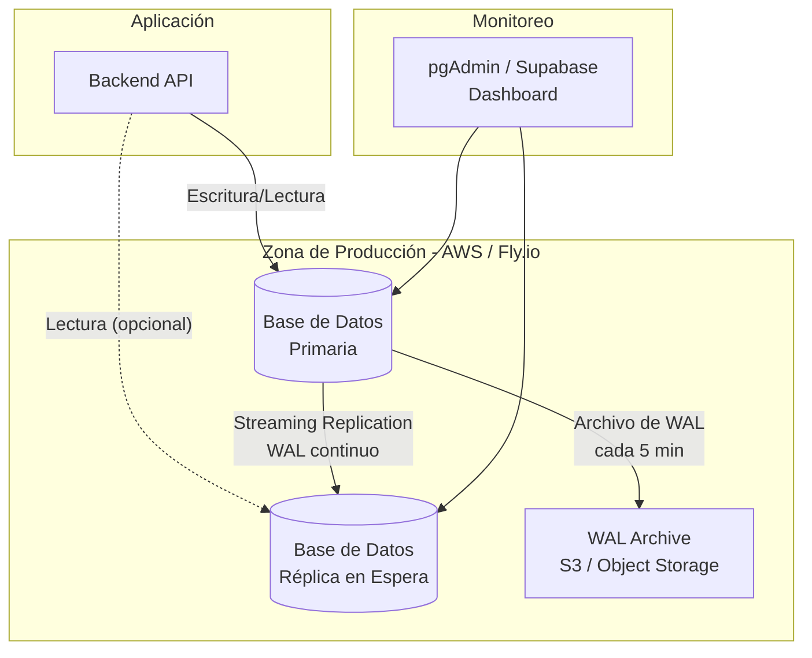

# Informe de Administración y Replicación de Base de Datos

## Información del Documento

| Campo | Detalle |
|-------|---------|
| Proyecto | SIGO-Ollas - Sistema de Gestión de Ollas Comunes |
| Motor de BD | PostgreSQL 15 (via Supabase) |
| Versión | 1.0 |
| Fecha | Mayo 2026 |

---

## 1. Motor de Base de Datos

| Propiedad | Detalle |
|-----------|---------|
| Motor | PostgreSQL 15 |
| Proveedor Cloud | Supabase (basado en AWS / Fly.io) |
| Versión mínima soportada | 15.x |
| Extensión principal | `pgcrypto` (cifrado AES-256) |
| Plan actual | Pro (escalable) |

### 1.1 Justificación de la Elección

| Criterio | PostgreSQL + Supabase | Alternativa (MySQL) | Alternativa (MongoDB) |
|----------|----------------------|---------------------|----------------------|
| Modelo relacional | ✅ Nativo | ✅ Nativo | ❌ Documental |
| Multi-tenant (RLS) | ✅ Políticas a nivel fila | ❌ No nativo | ❌ No nativo |
| Cifrado integrado | ✅ pgcrypto | ⚠️ Parcial | ✅ Nativo |
| Escalabilidad | ✅ Horizontal con read replicas | ✅ Horizontal | ✅ Nativo |
| Costo operativo | ✅ Bajo (managed service) | ✅ Bajo | ⚠️ Medio-alto |
| Extensibilidad | ✅ JSON, GIS, Full-text search | ⚠️ Limitado | ✅ Flexible |

**Decisión**: PostgreSQL 15 sobre Supabase ofrece el mejor equilibrio entre seguridad (RLS, pgcrypto), escalabilidad y costo para un SaaS multi-tenant académico.

---

## 2. Estrategia de Replicación

### 2.1 Tipo de Replicación Propuesta

Se propone una **replicación asíncrona basada en Write-Ahead Log (WAL)** mediante **Streaming Replication** nativa de PostgreSQL.

| Propiedad | Configuración |
|-----------|---------------|
| Tipo | Streaming Replication asíncrona |
| Topología | 1 primario + 1 réplica en espera (hot standby) |
| Sincronía | Asíncrona (mínima latencia en escritura) |
| Conmutación | Manual con `pg_ctl promote` |
| Almacenamiento | WAL archiving continuo |

### 2.2 Diagrama de Arquitectura de Replicación



### 2.3 Flujo de Replicación

1. El primario procesa todas las escrituras (INSERT, UPDATE, DELETE)
2. Los cambios se registran en el Write-Ahead Log (WAL)
3. La réplica se conecta al primario y recibe el WAL en tiempo real
4. La réplica aplica los cambios en modo `hot_standby` (lectura disponible)
5. Periódicamente, el WAL se archiva a almacenamiento externo (S3)

### 2.4 Justificación Técnica

| Aspecto | Decisión | Motivo |
|---------|----------|--------|
| **Asíncrona vs síncrona** | Asíncrona | El sistema no requiere consistencia transaccional inmediata en la réplica; prioriza rendimiento en escritura |
| **Hot standby vs warm** | Hot standby | Permite usar la réplica para consultas de lectura pesadas (reportes, dashboards) |
| **Número de réplicas** | 1 | Suficiente para un MVP académico; escalable a N réplicas según demanda |
| **Conmutación** | Manual | Reduce complejidad operativa; la conmutación automática (patroni) se implementaría en producción |

### 2.5 Cobertura de Objetivos de Recuperación

| Métrica | Objetivo | Con esta estrategia |
|---------|----------|---------------------|
| RPO (Recovery Point Objective) | < 5 minutos | ✅ ~1-2 segundos (asíncrono) |
| RTO (Recovery Time Objective) | < 30 minutos | ✅ ~10-15 minutos (promoción manual) |
| Disponibilidad | 99.5% (3.6h/mes) | ✅ 99.9% (con réplica) |

---

## 3. Estrategia de Respaldo (Backup)

### 3.1 Respaldo Automatizado

Supabase proporciona backups automáticos gestionados:

| Tipo | Frecuencia | Retención | Descripción |
|-----|------------|-----------|-------------|
| Completo (Point-in-Time) | Cada 2 horas | 7 días | Permite restaurar a cualquier punto en el tiempo |
| Completo diario | Diario | 30 días | Snapshot completo del día |
| WAL continuo | Continuo | 7 días | Archivo de todos los cambios |

### 3.2 Respaldo Manual (Complementario)

Adicionalmente, se recomienda ejecutar backups manuales antes de cambios mayores al esquema:

```bash
# Backup completo via pg_dump
pg_dump --host=db.supabase.co \
        --port=5432 \
        --username=postgres \
        --dbname=postgres \
        --format=custom \
        --file=backup_$(date +%Y%m%d_%H%M%S).dump

# Backup de solo esquema (para versionar)
pg_dump --host=db.supabase.co \
        --port=5432 \
        --username=postgres \
        --dbname=postgres \
        --schema-only \
        --file=schema_$(date +%Y%m%d).sql
```

### 3.3 Política de Retención

| Tipo de Backup | Retención | Almacenamiento |
|---------------|-----------|----------------|
| PITR continuo | 7 días | Supabase managed |
| Completo diario | 30 días | Supabase managed |
| Manual pre-migración | Indefinido | Repositorio / S3 |
| Esquema versionado | Indefinido | Git (migrations) |

### 3.4 Pruebas de Restauración

Se realizarán pruebas de restauración trimestrales para verificar la integridad de los backups:

1. Restaurar backup en entorno de staging
2. Ejecutar pruebas de integridad (conteo de registros, constraints, FKs)
3. Verificar consistencia de datos críticos (beneficiarios, entregas)
4. Documentar resultados y tiempo de restauración

---

## 4. Buenas Prácticas de Administración

### 4.1 Gestión de Migraciones

Las migraciones de esquema se gestionan mediante archivos SQL versionados:

```
supabase/migrations/
├── 20260424004514_initial_schema.sql
├── 20260424053000_seed_initial_tenants.sql
├── 20260424102000_add_tenant_category_and_location.sql
└── 001_add_lat_lng.sql
```

**Reglas**:
- Nunca crear tablas manualmente en el dashboard de Supabase
- Cada cambio debe tener su propia migración
- Las migraciones son irreversibles (siempre añadir, nunca eliminar)
- Usar transacciones explícitas (`BEGIN` / `COMMIT`) en migraciones complejas

### 4.2 Monitoreo y Alertas

| Métrica | Herramienta | Alerta | Acción |
|---------|-------------|--------|--------|
| Uso de CPU > 80% | Supabase Dashboard | Email + Slack | Escalar recursos |
| Conexiones activas > 80% | Supabase Dashboard | Email | Revisar pool de conexiones |
| Tamaño de BD > 10GB | Supabase Dashboard | Email | Archivar datos históricos |
| Replication lag > 30s | Consulta `pg_stat_replication` | Slack | Verificar red/carga |
| Backup fallido | Supabase Dashboard | Email | Iniciar backup manual |

### 4.3 Optimización de Consultas

- **Consultas parametrizadas**: Todas las consultas usan parámetros (no concatenación) para prevenir SQL injection
- **Índices**: Creados en todas las FKs y columnas de búsqueda frecuente
- **N+1 queries**: El backend usa joins y selects específicos para evitar N+1
- **Plan de ejecución**: Revisar con `EXPLAIN ANALYZE` consultas lentas (>100ms)

### 4.4 Seguridad

| Práctica | Implementación |
|----------|----------------|
| Autenticación | Supabase Auth con JWT |
| Authorization | Row Level Security (RLS) por tenant_id |
| Cifrado en tránsito | TLS 1.3 (obligatorio) |
| Cifrado en reposo | AES-256 via pgcrypto para datos sensibles |
| Auditoría | Tabla `audit_logs` para todas las operaciones DML |
| Secretos | Variables de entorno, nunca en el código |

### 4.5 Mantenimiento Programado

| Tarea | Frecuencia | Ventana | Descripción |
|-------|------------|---------|-------------|
| VACUUM | Automático (PostgreSQL) | - | Limpieza de tuplas muertas |
| ANÁLISIS de estadísticas | Automático | - | Actualizar planificador de consultas |
| Revisión de índices | Mensual | Domingo 03:00 | Reindexar si es necesario |
| Prueba de restauración | Trimestral | - | Validar integridad de backups |
| Actualización de versión | Según release | Ventana de mantenimiento | Programado con tiempo |

---

## 5. Plan de Continuidad ante Desastres

### 5.1 Escenarios y Respuesta

| Escenario | Impacto | Respuesta | Tiempo objetivo |
|-----------|---------|-----------|-----------------|
| Pérdida de datos (error humano) | Alto | Restauración PITR al punto anterior al error | < 1 hora |
| Caída del primario | Alto | Promover réplica a primario | < 15 minutos |
| Caída de ambos nodos | Crítico | Restaurar desde backup completo + WAL | < 2 horas |
| Corrupción de datos | Alto | Restauración PITR + verificación de integridad | < 3 horas |

### 5.2 Procedimiento de Conmutación por Fallo (Failover)

```bash
# 1. Verificar estado del primario
psql -h db.supabase.co -c "SELECT pg_is_in_recovery();"

# 2. Si el primario está caído, promover la réplica
# (ejecutar en el servidor de réplica)
pg_ctl promote -D /var/lib/postgresql/data

# 3. Verificar que la réplica ahora acepta escrituras
psql -h replica.supabase.co -c "SELECT pg_is_in_recovery();"
# => debe devolver 'f'

# 4. Actualizar cadena de conexión en la aplicación
# (cambiar SUPABASE_URL a la URL de la réplica promovida)

# 5. Verificar datos críticos
psql -h replica.supabase.co -c "SELECT COUNT(*) FROM beneficiaries;"
```

---

## 6. Referencias

- PostgreSQL Documentation - High Availability: https://www.postgresql.org/docs/15/high-availability.html
- PostgreSQL Streaming Replication: https://www.postgresql.org/docs/15/warm-standby.html
- Supabase Backups: https://supabase.com/docs/guides/platform/backups
- Supabase Database Migrations: https://supabase.com/docs/guides/deployment/database-migrations
- NIST SP 800-34 Contingency Planning Guide
- ISO 27001:2022 A.17 - Business Continuity
