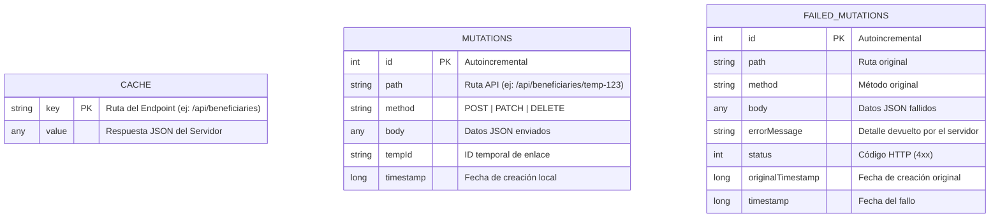
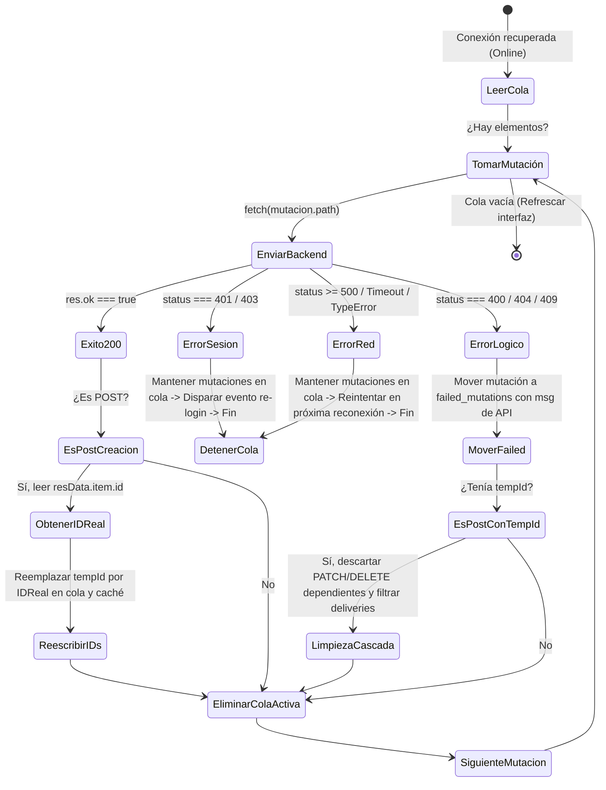

# Arquitectura PWA y Offline-First: Documentación Técnica de Implementación

Esta documentación detalla de manera exhaustiva el diseño, la estructura de archivos, el flujo de datos y las mecánicas de sincronización implementadas en el proyecto **Ollas Comunes** para habilitar capacidades **PWA (Progressive Web App)** y un comportamiento **Offline-First** completo. Esta arquitectura está pensada específicamente para las lideresas de ollas comunes en zonas rurales o de conectividad inestable en el Perú.

---

## Índice
1. [Introducción y Objetivos](#1-introducción-y-objetivos)
2. [Estructura de Archivos del Sistema PWA](#2-estructura-de-archivos-del-sistema-pwa)
3. [Manifiesto y Service Worker](#3-manifiesto-y-service-worker)
4. [Persistencia Local con IndexedDB](#4-persistencia-local-con-indexeddb)
5. [Intercepción de Consultas y Mutaciones Optimistas](#5-intercepción-de-consultas-y-mutaciones-optimistas)
6. [Bucle de Sincronización Inteligente](#6-bucle-de-sincronización-inteligente)
7. [Mapeo de Errores de Base de Datos en el Backend](#7-mapeo-de-errores-de-base-de-datos-en-el-backend)
8. [Interfaz de Gestión de Conflictos y UI Banner](#8-interfaz-de-gestión-de-conflictos-y-ui-banner)
9. [Flujo de Pruebas y Verificación E2E](#9-flujo-de-pruebas-y-verificación-e2e)

---

## 1. Introducción y Objetivos

El objetivo principal de esta implementación es proporcionar una experiencia de usuario idéntica a la de una aplicación móvil nativa (como una construida en Flutter o Android Studio), pero utilizando tecnología web instalable (PWA) de bajo peso y mínimo consumo.

### Objetivos Clave:
* **Operación 100% Desconectada:** Permitir a las lideresas registrar beneficiarios, registrar raciones entregadas, ejecutar menús planificados y ajustar insumos en el inventario sin ninguna conexión a internet.
* **Actualizaciones Optimistas e Inmediatas:** La interfaz debe reaccionar de manera instantánea a los cambios locales (como si estuvieran guardados en el servidor) para que el usuario no experimente pantallas bloqueadas o errores de red.
* **Sincronización Transparente:** Al detectar que el dispositivo recupera la conexión a internet, el sistema debe procesar las operaciones acumuladas secuencialmente, resolver dependencias de datos y persistirlas en la base de datos central PostgreSQL.
* **Resiliencia ante Errores:** Evitar que fallos lógicos (ej. DNI duplicado) o de autenticación bloqueen de forma indefinida la cola de sincronización.

---

## 2. Estructura de Archivos del Sistema PWA

El sistema se compone de piezas distribuidas estratégicamente en el frontend y en el backend:

```text
├── backend
│   └── src
│       └── modules
│           ├── beneficiaries
│           │   └── router.ts        <-- Mapeo de errores de Prisma a HTTP semánticos
│           ├── mobile
│           │   └── router.ts        <-- Mapeo de errores de Prisma en APIs móviles
│           └── organizations
│               └── router.ts        <-- Mapeo de errores en APIs de organizaciones
│
└── frontend
    ├── public
    │   ├── manifest.json            <-- Manifiesto PWA de instalación
    │   └── sw.js                    <-- Service Worker (Pre-caché y assets estáticos)
    └── src
        ├── app
        │   └── layout.tsx           <-- Script de registro del sw.js en cliente
        ├── components
        │   ├── general
        │   │   └── pwa-sync-manager.tsx <-- Bucle inteligente de sincronización online
        │   └── ui
        │       └── offline-banner.tsx   <-- Interfaz de estado y visualizador de conflictos
        ├── hooks
        │   ├── use-api.ts           <-- Gancho de intercepción y optimismo móvil
        │   └── use-online.ts        <-- Gancho reactivo para monitorizar estado de red
        └── lib
            ├── beneficiaries-api.ts <-- Cliente API de beneficiarios con fallback offline
            └── indexed-db.ts        <-- Capa de datos IndexedDB (versión 2)
```

---

## 3. Manifiesto y Service Worker

### Manifiesto de Aplicación (`manifest.json`)
Ubicado en `frontend/public/manifest.json`. Define las propiedades de instalación en el dispositivo móvil (pantalla de inicio, colores corporativos, iconos y modo de despliegue stand-alone):

```json
{
  "name": "Ollas Comunes",
  "short_name": "OllasComunes",
  "description": "Plataforma de gestión comunitaria para Ollas Comunes",
  "start_url": "/login",
  "display": "standalone",
  "background_color": "#111827",
  "theme_color": "#059669",
  "icons": [
    {
      "src": "/icons/icon-192.png",
      "sizes": "192x192",
      "type": "image/png",
      "purpose": "any maskable"
    },
    {
      "src": "/icons/icon-512.png",
      "sizes": "512x512",
      "type": "image/png"
    }
  ]
}
```

### Service Worker (`sw.js`)
Ubicado en `frontend/public/sw.js`. Se ejecuta en un hilo secundario del navegador y se encarga de:
1. **Pre-caché de Recursos Críticos:** Almacena vistas estáticas (/login, /login/otp) y recursos vectoriales (.svg) durante la instalación.
2. **Estrategia Network-First con Fallback a Caché:** Intercepta peticiones del navegador para recursos estáticos y de navegación de páginas. Intenta descargarlos desde la red; si falla, sirve la copia en caché. Si el usuario intenta navegar offline y no existe copia en caché, devuelve el cascarón de la página `/login`.
3. **Bypass de APIs:** Excluye peticiones dirigidas a `/api/*` y canales HMR (Webpack/Turbopack) para permitir que los clientes API del frontend manejen la lógica de datos dinámicos.

---

## 4. Persistencia Local con IndexedDB

Para el almacenamiento estructurado y transaccional offline, se implementó un módulo nativo en [indexed-db.ts](file:///d:/Repositories/proyecto-ollas-comunes/frontend/src/lib/indexed-db.ts). La base de datos es `ollas-comunes-db` (Versión `2`).

### Almacenes de Objetos (Stores):
* **`cache`:** Almacén de clave-valor para respuestas serializadas de peticiones `GET` (listados de beneficiarios, KPIs del dashboard, stock de inventario, etc.).
* **`mutations`:** Cola secuencial autoincremental que guarda las peticiones de escritura pendientes (`POST`, `PATCH`, `DELETE`). Cada registro incluye la ruta, el método, el cuerpo de la petición, la marca de tiempo original y opcionalmente un `tempId` de rastreo.
* **`failed_mutations`:** Historial de mutaciones rechazadas permanentemente por el servidor debido a reglas de negocio (ej: DNI ya registrado). Almacena el cuerpo original de la petición y el mensaje de error devuelto por la API.

### Diagrama de Relación de Datos Locales:



---

## 5. Intercepción de Consultas y Mutaciones Optimistas

La intercepción de red y optimismo se realiza a través de dos clientes unificados: [beneficiaries-api.ts](file:///d:/Repositories/proyecto-ollas-comunes/frontend/src/lib/beneficiaries-api.ts) (escritorio/workspace) y [use-api.ts](file:///d:/Repositories/proyecto-ollas-comunes/frontend/src/hooks/use-api.ts) (móvil).

### Lógica de Intercepción:
1. **Petición GET:**
   * Si el dispositivo está **offline**, se consulta el almacén `cache` en IndexedDB indexando por la ruta completa (incluyendo query params). Si se encuentra, se devuelve de inmediato; si no, se lanza un error descriptivo.
   * Si está **online**, se realiza el `fetch` ordinario. Si es exitoso, se guarda una copia en el almacén `cache` antes de devolver los datos. Si falla por red caída, se sirve la copia de caché local como fallback.
2. **Peticiones de Escritura (POST/PATCH/DELETE):**
   * Si el dispositivo está **offline** (o falla la conexión de red durante el envío), se intercepta la petición.
   * Se genera un ID temporal para creaciones (`temp-xxxxxx`).
   * Se registra la mutación en la cola `mutations` de IndexedDB mediante `addMutation()`.
   * Se ejecuta una **Actualización Optimista** sobre la caché correspondiente para que la UI refleje el cambio de inmediato:

### Detalles de las Actualizaciones Optimistas por Ruta:

#### A. Gestión de Beneficiarios (`/api/beneficiaries`):
* **`POST`:** Inserta un registro simulado con el ID temporal al inicio del listado en caché (`/api/beneficiaries`), calculando su nombre completo y marcándolo como registro local (`offline: true`).
* **`PATCH`:** Busca el ID en el listado en caché y mezcla los nuevos valores del cuerpo.
* **`DELETE`:** Remueve físicamente el registro del listado en caché.

#### B. Entrega de Raciones (`/api/mobile/deliveries`):
* Lee el listado de beneficiarios en caché y marca como `hasEatenToday: true` a todos los IDs incluidos en `beneficiaryIds`.
* Lee el dashboard en caché (`/api/mobile/dashboard`) e incrementa el contador de raciones entregadas (`summary.entregadas`) y descuenta las raciones remanentes del menú activo (`summary.menu.maxServingsRemaining`).

#### C. Plan de Menú (`/api/mobile/menu-plans/execute`):
* Inyecta el menú en caché (`/api/mobile/dashboard`) estableciendo el estado del plato diario a `"executed"` e inicializa el stock de raciones disponibles.

#### D. Movimiento de Inventario (`/api/mobile/inventory/movements`):
* Lee la caché de inventario (`/api/mobile/inventory`), busca el insumo por `supplyItemId` y modifica su stock actual sumando (si es `"in"`) o restando (si es `"out"` o `"waste"`) la cantidad especificada.

---

## 6. Bucle de Sincronización Inteligente

El gestor principal de la cola es el componente [pwa-sync-manager.tsx](file:///d:/Repositories/proyecto-ollas-comunes/frontend/src/components/general/pwa-sync-manager.tsx). Escucha reactivamente el evento `online` del navegador y procesa la cola de mutaciones de forma secuencial y ordenada:

```typescript
for (let i = 0; i < mutations.length; i++) {
  const mutation = mutations[i]
  // Envío mediante fetch al backend...
}
```

### Flujo de Sincronización Detallado:



### Funcionalidades Avanzadas de Sincronización:

#### 1. Reescritura de IDs Dinámicos
Cuando se sincroniza un `POST` con éxito y este contenía un `tempId` (ej. `temp-123`), el servidor devuelve el ID real de base de datos (ej. `real-uuid-999`). 
El Sync Manager recorre el resto de mutaciones en cola y actualiza cualquier referencia:
* **Paths:** Peticiones como `PATCH /api/beneficiaries/temp-123` se transforman a `PATCH /api/beneficiaries/real-uuid-999`.
* **Cuerpos:** Se serializa y reemplaza la cadena de texto de los cuerpos de forma recursiva (ej. `beneficiaryIds: ["temp-123"]` cambia a `["real-uuid-999"]`).

#### 2. Limpieza en Cascada por Fallos
Si el `POST` de un elemento con `tempId` falla permanentemente en la sincronización, el Sync Manager aplica reglas de limpieza para evitar fallas en cadena en las mutaciones siguientes:
* **Edición/Eliminación:** Los `PATCH` o `DELETE` dirigidos al path de ese `tempId` se eliminan de la cola activa y se envían a `failed_mutations` marcados como cancelados en cascada, debido a que el recurso nunca existió en el servidor.
* **Integridad de Llaves Foráneas:** Si una mutación dependiente (ej. entrega de raciones) contiene el `tempId` en su array `beneficiaryIds`, este se remueve del array antes de enviarse. Si el array queda vacío y no hay raciones generales, la mutación se descarta.

---

## 7. Mapeo de Errores de Base de Datos en el Backend

Para evitar que fallas de base de datos Postgres (Prisma) devuelvan códigos `500` que obliguen al Sync Manager a reintentar y bloquear la cola indefinidamente, se modificó la lógica de manejo de errores en los enrutadores de Express en el backend:

* [router.ts (Beneficiarios)](file:///d:/Repositories/proyecto-ollas-comunes/backend/src/modules/beneficiaries/router.ts)
* [router.ts (Mobile)](file:///d:/Repositories/proyecto-ollas-comunes/backend/src/modules/mobile/router.ts)
* [router.ts (Organizations)](file:///d:/Repositories/proyecto-ollas-comunes/backend/src/modules/organizations/router.ts)

Se interceptan las siguientes excepciones conocidas de Prisma:

```typescript
if (error && typeof error === 'object' && 'code' in error) {
  const prismaErr = error as { code: string; message?: string }
  if (prismaErr.code === 'P2002') {
    response.status(409).json({
      ok: false,
      message: 'Conflicto: Ya existe un registro con valores duplicados para un campo único (DNI u otro).',
    })
    return
  }
  if (prismaErr.code === 'P2003') {
    response.status(400).json({
      ok: false,
      message: 'Error de integridad: La operación hace referencia a un elemento que no existe (clave foránea no válida).',
    })
    return
  }
  if (prismaErr.code === 'P2025') {
    response.status(404).json({
      ok: false,
      message: 'No encontrado: El registro solicitado para actualizar o eliminar no existe.',
    })
    return
  }
}
```

---

## 8. Interfaz de Gestión de Conflictos y UI Banner

Ubicado en [offline-banner.tsx](file:///d:/Repositories/proyecto-ollas-comunes/frontend/src/components/ui/offline-banner.tsx). El banner gestiona de manera reactiva e integral la visualización del estado de conexión y los conflictos:

### Estados Visuales:
1. **Modo Offline Activo:** Un badge flotante inferior en color naranja que avisa la desconexión y muestra el número de cambios guardados localmente:
   * *"Sin conexión — Modo offline activo (3 guardado(s) local)"*
2. **Sincronización en Progreso:** Un banner superior en verde esmeralda con una animación de recarga que avisa el procesamiento de la cola:
   * *"Sincronizando 3 cambio(s) pendiente(s)..."*
3. **Advertencia de Conflictos:** Si existen registros en `failed_mutations`, se añade un indicador de advertencia:
   * *"Hay 2 conflicto(s) de sincronización. [Revisar]"*

### Cajón Móvil de Conflictos (Drawer):
Al presionar "Revisar" o "errores", se despliega una hoja inferior responsiva (`Sheet` de Radix UI) optimizada para celulares. Esta interfaz permite:
* Ver el tipo de operación que falló (ej. *"Registrar Beneficiario"*).
* Ver los detalles del recurso afectado (ej. *"Juan Pérez (DNI: 12345678)"*).
* Mostrar el **mensaje de error semántico explícito** que devolvió el servidor o el manejador de base de datos (ej. *"Ya existe un beneficiario con ese DNI en esta organización."*).
* Descartar el conflicto individualmente (removiéndolo de `failed_mutations`) mediante un botón de papelera o eliminar todos de forma masiva con "Descartar todo".

---

## 9. Flujo de Pruebas y Verificación E2E

Para garantizar que esta compleja lógica funcione de forma integrada, se creó una especificación automatizada de extremo a extremo utilizando Playwright en [offline.spec.ts](file:///d:/Repositories/proyecto-ollas-comunes/frontend/e2e/offline.spec.ts).

### Fases del Test E2E:
1. **Inicio de Sesión Online:** Inicia sesión con credenciales administrativas y realiza verificación MFA (código TOTP generado dinámicamente en memoria utilizando la librería `otplib` contra el secreto de base de datos).
2. **Pre-cargado de Caché:** Navega al padrón general para que las peticiones GET se almacenen en el almacén `cache` de IndexedDB.
3. **Simulación de Desconexión de Red:** Apaga la conexión de red del navegador virtual a nivel de contexto de Playwright:
   ```typescript
   await context.setOffline(true);
   ```
4. **Verificación de Alertas Offline:** Valida que el banner flotante sea visible en la interfaz e informe de la desconexión.
5. **Creación Local Offline:** Genera un DNI aleatorio para evitar conflictos previos, llena el formulario de alta de beneficiario y pulsa "Registrar". Comprueba que el modal de creación se cierre normalmente y que el banner de red cambie su mensaje informando que hay exactamente `(1 guardado(s) local)`.
6. **Simulación de Reconexión de Red:** Restaura la red del navegador:
   ```typescript
   await context.setOffline(false);
   ```
7. **Procesamiento de Cola y Recarga:** Espera a que se gatille el evento de sincronización y ocurra la recarga automática de la aplicación.
8. **Verificación en Base de Datos Real:** Accede directamente a la base de datos PostgreSQL real utilizando Prisma Client y realiza una búsqueda del beneficiario por el DNI aleatorio utilizado:
   ```typescript
   const dbBeneficiary = await prisma.beneficiary.findUnique({
     where: { dni: randomDni }
   });
   expect(dbBeneficiary).not.toBeNull();
   ```
9. **Limpieza:** Elimina el beneficiario de pruebas creado en la base de datos física para mantener limpio el entorno de pruebas.
